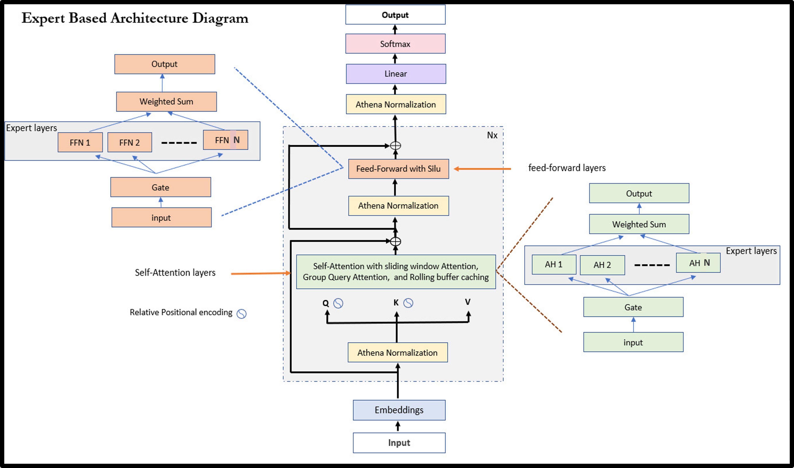

# Fattah
This is a Bengali small Language model with custom Transformer based decoder architecture.
Here is the architecture of Fattah.


## Clone:
```bash
git clone https://github.com/sazzad1779/Fattah_SLM.git
```
## Model Usage
To load the models, you need install this package:

```bash
pip install -e .
```

Then you can load the model with the following code:

```python 
from src.Fattah import fattahModel, fattahForCausalLM, fattahConfig, fattahForSequenceClassification
from transformers import AutoTokenizer, AutoModel,AutoModelForCausalLM, AutoConfig, AutoModelForSequenceClassification

AutoConfig.register("fattah", fattahConfig)
AutoModelForCausalLM.register(fattahConfig, fattahForCausalLM)
AutoModelForSequenceClassification.register(fattahConfig, fattahForSequenceClassification)

tokenizer = AutoTokenizer.from_pretrained('sha1779/fattah')
model = AutoModelForCausalLM.from_pretrained('sha1779/fattah')
```
